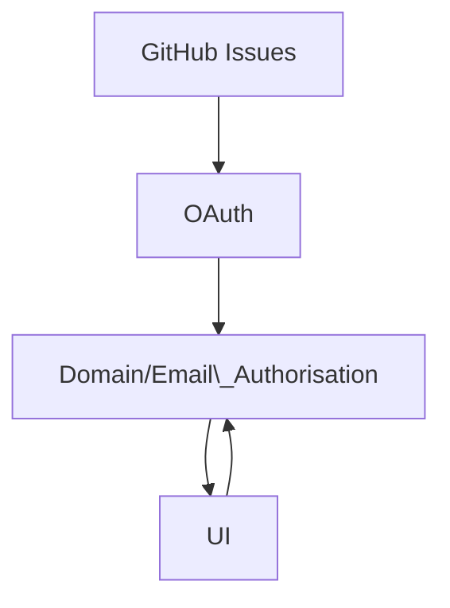

# GLD-ISSUES

- [Features](#Features)
  - [New look](#new-look)
  - [New ways to interact with issues](#new-ways-to-interact-with-issues)
  - [New ways to organise issues](#new-ways-to-organise-issues)

This is a custom UI / Project management system that leverages [GitHub Issues](https://github.com/features/issues) for the backend.

## Features

It is still evolving but below are some of the current features.

### New look

- #### Fresh custom UI
  Inspired by Monday.com, Github and Asana built from scratch for simplicity and ease of use.

### New ways to interact with issues

- #### Easy topline editing

  Update the title, deadline and issue status from the main category view with no need to leave the page.

- #### Collapsible issues

  Each issue expands inline to give you more detailed access for editing so you do not need to navigate away to edit.

- #### Easy issue addition

  Add a issue to a category with one click. Enter your title and you are done, no need to navigate away or assign labels.

- #### Progress bars

  Each category has its own progress bar, showing at a glance how many completed issues are within the category.

### New ways to organise issues

- #### Deadlines

  Easily add deadlines to your issues by adding a dd/mm/yy to the end of the title, or using the dedicated deadline field. Each deadline will also give you an interactive countdown to show either which day and week number the deadline falls on, or the number of remaining business days until the deadline.

- #### Categories

  Issue labels are used to make collaspible categories for issues that can be easily added to with one-click.

- #### Category one-click filtering

  The category section features progress bars showing the proportion of issues that are completed, blocked, progressing or testing. Clicking on a category will filter issues so that only that category can be seen.
  - #### Status one-click filtering

  Filter the issues within each category by status: open, completed, blocked, testing or issues with deadlines.

- #### View modes

  Change view mode to view issues either by category, deadline or open status.

- #### Filter Titles

  Start typing to filter titles by keyword across categories.

